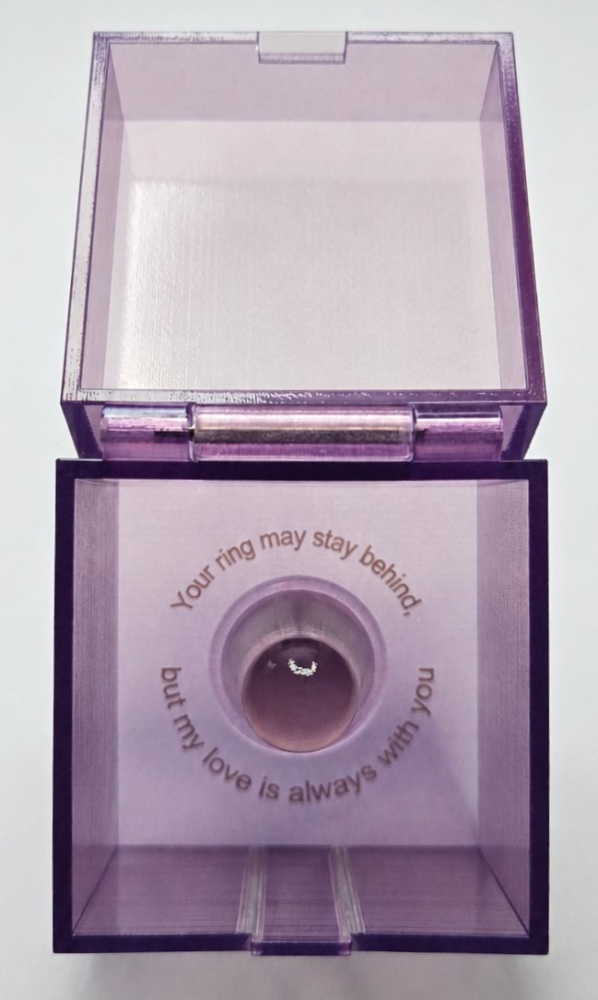
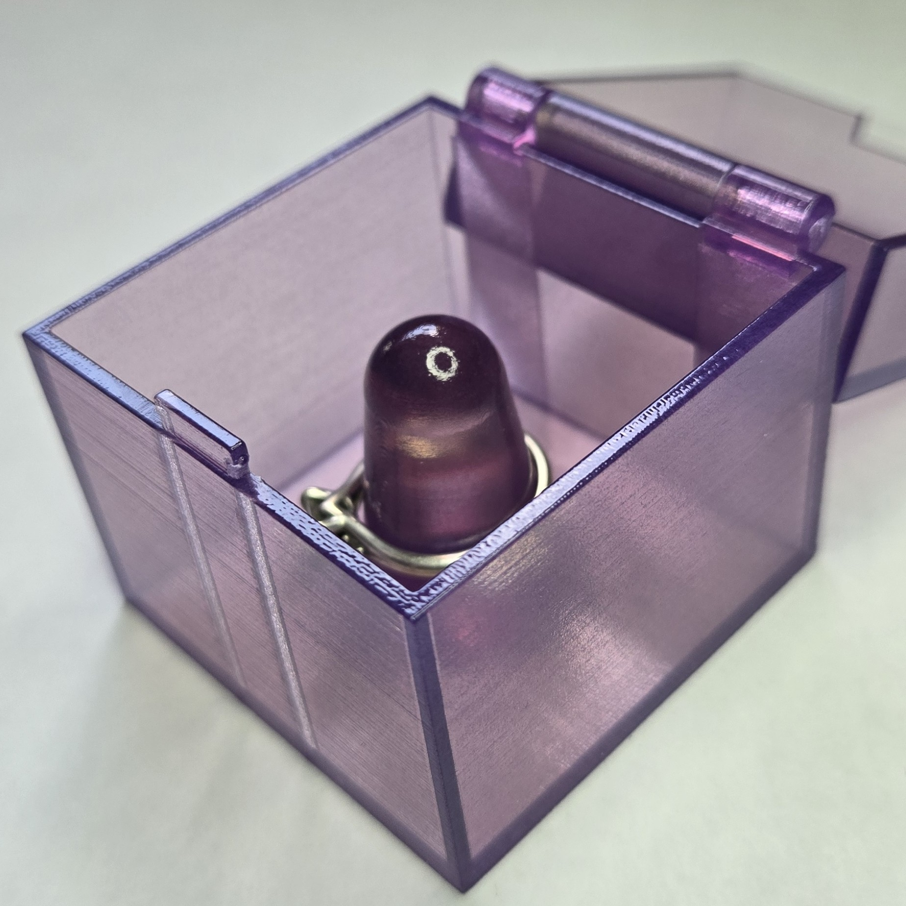
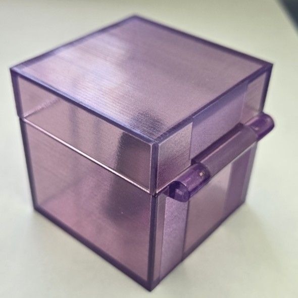

# AI-CAD Ring Box

## Overview
This design proved the idea of using Gemini to quickly create useful CAD files to spec.

My wife is a competitive Outrigger Canoe paddler, and she needs to remove her jewelry before practice for safety. She felt bad leaving her engagement ring behind, so I made a special place for her to keep it.
I created this project solely using AI (Gemini). In seeing how poor the Gemini model was with CAD models I uploaded a series of papers by Ian Huang (https://scholar.google.com/citations?view_op=list_works&hl=en&hl=en&user=PTfn2rsAAAAJ) that
proposed a better potential interface with the model. Then I trained the model to ask questions about the project and not to stop until it was perfectly clear on what was needed.
Once generated I had it generate the CAD model as Python code, then used the 'EditPythonScript' command in Rhino to render the model, and went back to the model to make any necessary changes. Once the model looked good, I exported an STP file from Rhino and uploaded that to Grab Cad. The hinge is from a pin used to connect watch bands to watches, which allows for potential removal if needed.

This design proved the idea of using Gemini to quickly create useful CAD files to spec.

## Photos
    

## Lessons Learned
- Gemini was NOT good with generating CAD natively (as of June 2026) which initially made the process of using it to design CAD tedious.
- Having the interface explicitly ask questions about the intended design instead of making guesses was a game changer!
- Adding Huang's papers shifted the model to thinking in 3D space, not 2D images.
- The papers and the model recurively helped me generate a text prompt implementing this rubric for use on future projects
