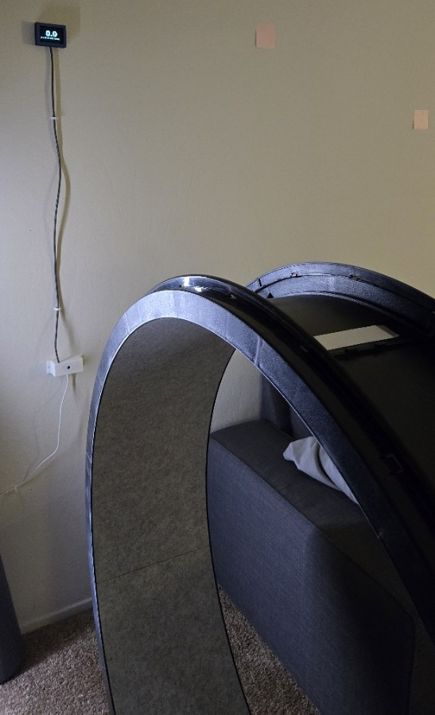
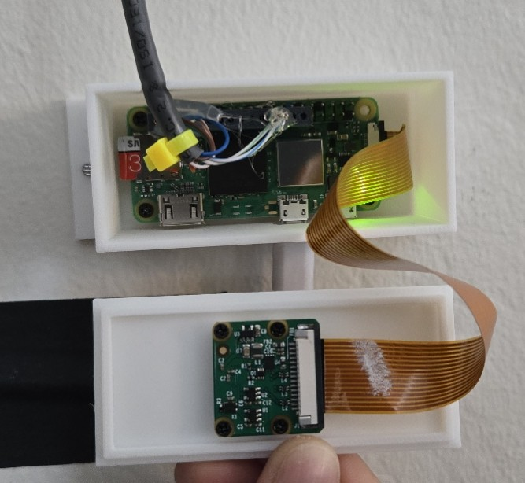
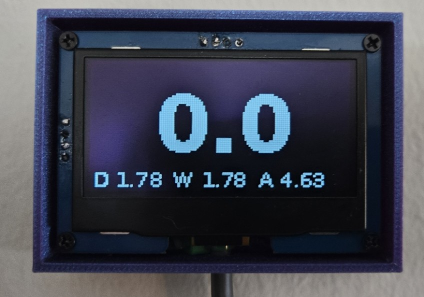

# Cat Wheel Speedometer  
One-Sheet Project Overview  
(OpenCV motion detection, Raspberry Pi vision pipeline, and OLED telemetry display)

## Overview
The Cat Wheel Speedometer is a computer-vision-based telemetry system that measures the running speed of a cat exercise wheel in real time. A Raspberry Pi camera monitors white markers placed on the wheel and uses OpenCV to detect each pass through a calibrated detection gate. From the time between passes, the system calculates RPM and converts it to wheel speed (mph), displaying the results on a small OLED screen mounted next to the wheel.

The system tracks daily, weekly, and all-time speed records and runs autonomously on a Raspberry Pi Zero 2 W using a Python application that starts automatically at boot.

This project was designed and built as a personal exploration of lightweight embedded computer vision and real-time telemetry systems, and was completed before starting my role at Google on March 2026.

## Photos

Wheel Speedometer Installed  

Wheel Speedometer Electronics  
 

Wheel Speedometer OLED Display  

Wheel Speedometer Enclosure Design  

## Bill of Materials

| Item | Description | Notes |
|-----|-------------|------|
| Raspberry Pi Zero 2 W | Runs Python, OpenCV detection, and display logic | Main controller |
| Raspberry Pi Camera Module (IMX219) | Captures wheel motion for detection | Mounted facing wheel |
| 0.96" I2C OLED Display | Displays real-time speed and records | SH1106 driver |
| White Wheel Markers | Four reflective strips placed around wheel | Enables motion detection |
| Pull-up Resistors (4.7kΩ) | Stabilize I²C communication | Added at OLED end |
| Custom Enclosure | Separate printed housings for camera and display | Designed in Fusion 360 |
| Wiring Harness | SDA/SCL/power wiring for OLED | Short run for signal integrity |

## How It Works

1. The camera continuously captures frames of the cat wheel.
2. A small region-of-interest “gate” is monitored for brightness changes.
3. When a white marker passes through the gate, the system detects a rising brightness edge.
4. The time between marker passes is used to compute wheel RPM.
5. RPM is converted to miles-per-hour using the known wheel diameter.
6. Speed and record values are displayed on the OLED screen.

The software also includes filtering logic to prevent double-counts and to smoothly decay the speed to zero when the wheel stops.

## Software

Primary runtime script:
`speedo2.py`

### Core technologies
- Python 3
- OpenCV
- Picamera2
- Luma OLED display library
- systemd service for automatic startup

### Key design parameters
- Wheel diameter: 43 inches
- Markers per revolution: 4
- OLED refresh: 1 Hz
- Exponential moving average smoothing for stable display

The system records speed statistics in a local JSON file and restores them automatically after reboot.

## Lessons Learned
- Computer vision can be surprisingly effective for physical telemetry when the geometry is controlled.
- Limiting I²C update frequency dramatically improves display reliability on embedded Linux systems.
- Simple brightness detection is often sufficient when the environment is constrained.
- Exponential smoothing produces a far more readable real-time speed display.

## License
MIT License
