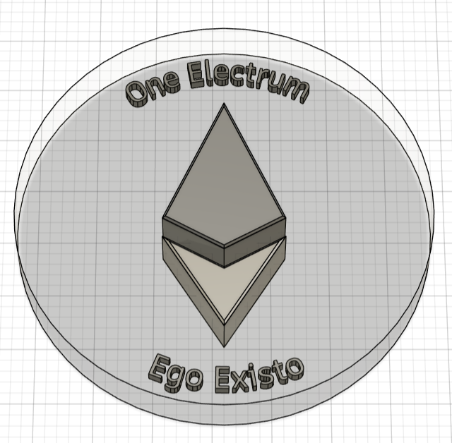
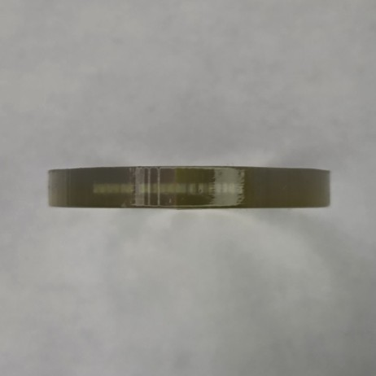

# Electrum Coin

## Overview
The Electrum coin was a 3D printing exercise to familiarize myself with the capabilities of the Stratasys J850 Polyjet 3D printing system. 

Among the practices used here were designing and saving the idea from Fusion 360, uploading it to GrabCAD for slicing and settings, then post processing the result with an eye towards clarity.|

Tactics used included printing directly on the bed, making the print glossy, implementing geometry has had an encased inner item that extended slightly beyond the top and bottom surface. The logo is a direct reference to Etherium.

## Photos
Final CAD model 
 

 

## Lessons Learned
- Moving the file from Fusion 360 into GrabCAD was surprisingly easy.
- High Mix machines do double your time, but the addition of full color capability is worth it for visual items.
- Optical clarity is a game of increased effort and decreasing returns between 90% clear and completely clear.
- Post-processing (and potential print bed damage) need to be accounted for when prnting directly on bed without supports on bottom.

## License
MIT License

