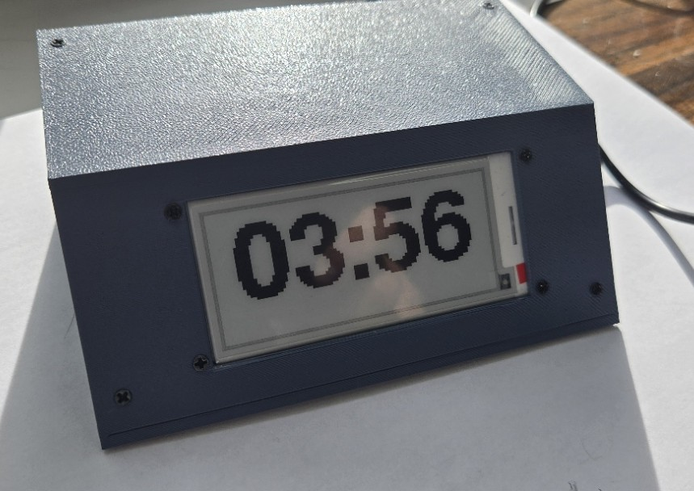
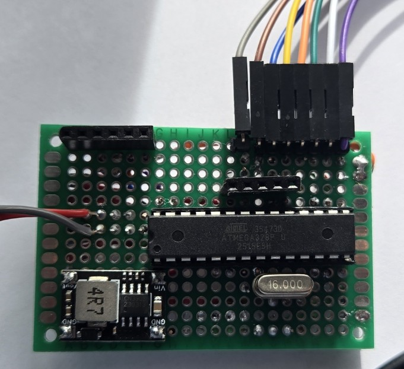
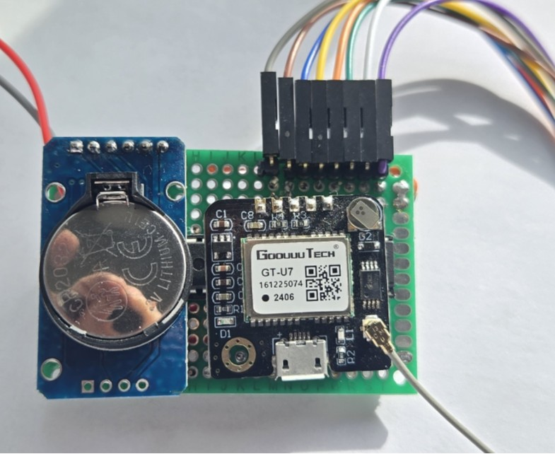
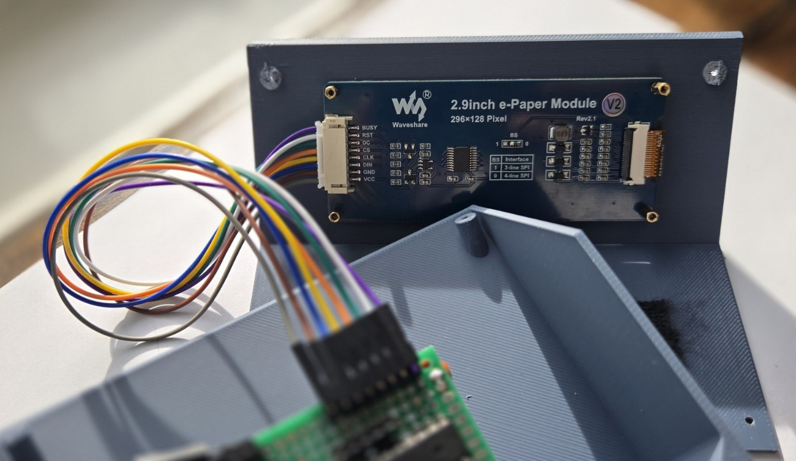
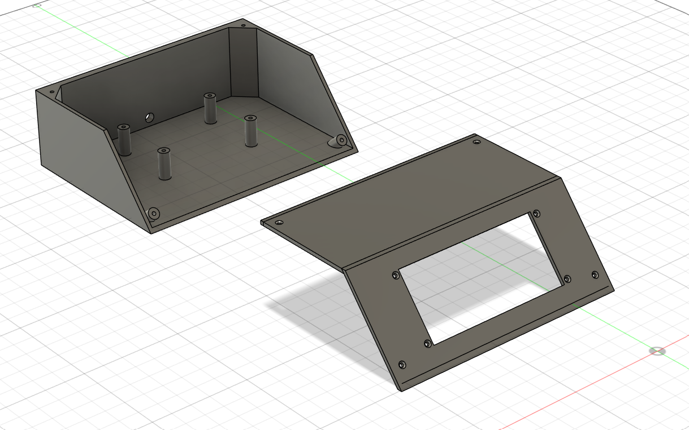

# GPSClock

The GPSClock is a low-power, GPS-disciplined wall clock built around an ATmega328P microcontroller.  
It combines a DS3231 real-time clock with periodic synchronization from a GT-U7 GPS module to maintain accurate time even during long periods without satellite visibility.

Time is displayed on a 2.9" Waveshare e-paper display using a custom rendering approach that scales a bitmap font algorithmically, allowing large, high-contrast text while staying within the ATmega328P's tight flash and SRAM limits. This project was completed ahead of starting my role at Google in March 2026.

The display shows:

• Large centered 12-hour time  
• Satellite count and GPS signal quality  
• Diagnostic timing data for synchronization verification

The system uses scheduled early redraws to compensate for e-paper refresh latency so the visible minute change occurs exactly at :00.

---

## Photos

Finished GPS Clock 

GPSClock Board Without Modules 
(Note spots to drop in GPS and RTC modules)  

GPSClock Board With modules 

GPSClock Lid 

GPSClock Enclosure Design 

---

## Bill of Materials

| Item | Description | Notes |
|-----|-------------|------|
| ATmega328P (Uno-compatible) | Main microcontroller | Handles timekeeping logic and display control |
| DS3231 RTC Module | Temperature-compensated real-time clock | Maintains stable time between GPS syncs |
| GT-U7 GPS Module | Provides accurate UTC time and satellite data | Periodically disciplines RTC |
| Waveshare 2.9" E-Paper Display | 296×128 monochrome e-paper panel | SPI interface |
| Buck Converter (5V → 3.3V) | Regulates display voltage | Required for e-paper module |
| Ceramic Capacitors | Decoupling and filtering | Placed near power rails |
| Electrolytic Capacitor (~100µF) | Power smoothing | Helps stabilize power input |
| USB Power Cable | Provides wall power | Routed through enclosure |
| Prototype Perfboard | Component mounting | Custom hand-wired layout |
| Custom 3D-Printed Enclosure | Wall-mounted housing | Designed in Fusion 360 |

---

## Wiring

### E-Paper Display (SPI)

| Signal | ATmega Pin |
|------|------|
| CS | D10 |
| DC | D9 |
| RST | D8 |
| BUSY | D7 |
| DIN (MOSI) | D11 |
| CLK (SCK) | D13 |
| VCC | 3.3V |
| GND | GND |

### RTC (I²C)

| Signal | ATmega Pin |
|------|------|
| SDA | A4 |
| SCL | A5 |
| VCC | 5V |
| GND | GND |

### GPS

| Signal | ATmega Pin |
|------|------|
| TXD | D4 |
| RXD | (unused) |
| VCC | 5V |
| GND | GND |

---

## Build Steps

1. Assemble components on a prototype perfboard.
2. Connect the e-paper display using the SPI pin mapping listed above.
3. Wire the DS3231 RTC to the ATmega via I²C.
4. Connect the GPS module TX output to ATmega pin D4 for serial data.
5. Add decoupling capacitors across power rails.
6. Power the system using a USB power cable routed through the enclosure.
7. Upload the firmware using the Arduino IDE.
8. Place the GPS antenna near a window for the initial satellite lock.
9. After the first successful GPS sync, the RTC maintains accurate time between updates.

---

## Code

1. Open the Arduino IDE.
2. Select **Arduino Uno** (or equivalent ATmega328P board).
3. Install required libraries:

- GxEPD2  
- Adafruit_GFX  
- TinyGPS++  
- RTClib  

4. Upload the project firmware.

The clock will:

• Attempt a GPS sync during startup  
• Periodically re-synchronize the RTC (~every 6 hours)  
• Render time updates on the e-paper display once per minute  

---

## Lessons Learned

• E-paper refresh latency requires drawing the next minute slightly early to make the visible transition occur exactly at :00.  

• Runtime font scaling allows large, clean text without storing multiple large fonts in flash memory.  

• Removing Serial debugging significantly improved timing consistency and reduced firmware size.  

• The DS3231 provides excellent holdover stability, allowing the clock to remain accurate even if GPS reception is temporarily unavailable.  

• GPS synchronization can be done infrequently (every several hours) while still maintaining precise time.

---

## License

MIT License
