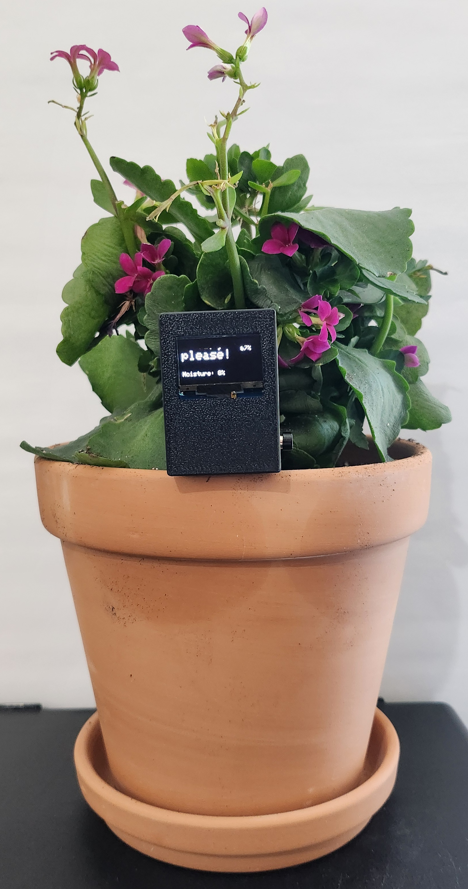
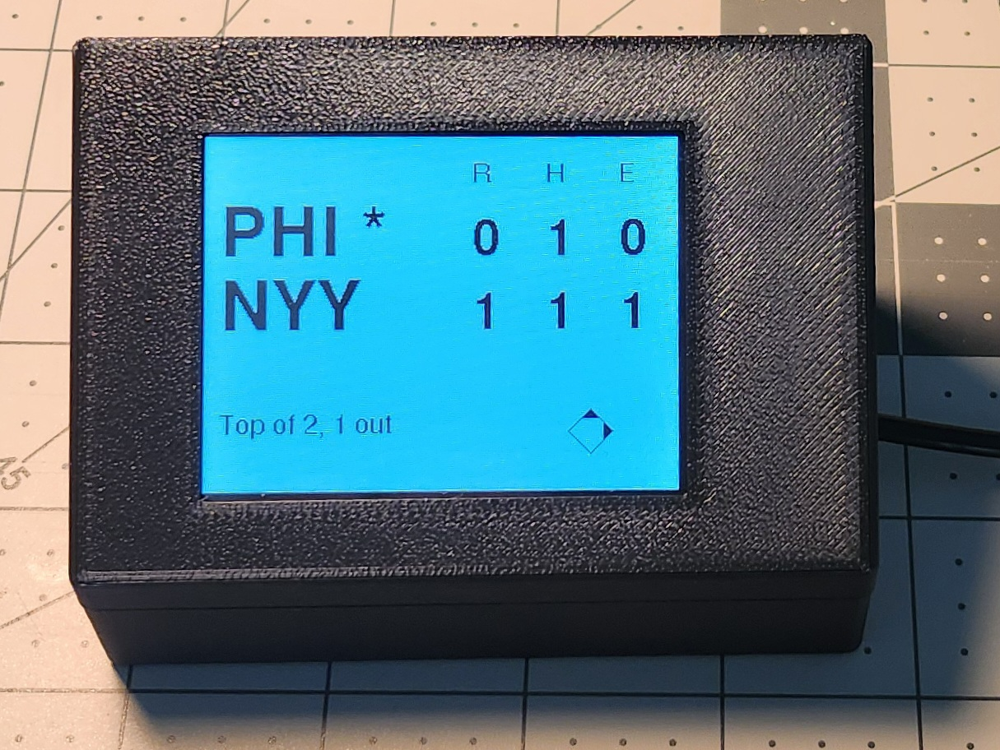

## Electronics & Maker Projects

Welcome! This is a collection of my hands-on electronics and product design builds — each project blends embedded programming, hardware integration, and 3D-printed enclosures.
They’re documented here both as a personal portfolio and as a resource for anyone interested in building similar devices.

## Projects
| Project | One-Sheet PDF | Description | Preview |
|---------|-----------------------|-------------|---------|
| [**The Orb**](./TheOrb) | [Quick Details and Build Reference](https://raw.githubusercontent.com/ChandlerEx/Projects/main/TheOrb/docs/Orb_One_Sheet.pdf) | Ambient LED orb that visualizes live stock performance through color and pulsing light. Powered by an ESP8266 D1 Mini with custom PCB, in a 3D-printed enclosure topped with a frosted glass globe. |  |
| [**Soil Moisture Monitor**](./SoilMonitor) | [Quick Details and Build Reference](https://raw.githubusercontent.com/ChandlerEx/Projects/main/SoilMonitor/docs/SoilMon_One_Sheet.pdf) | Battery-powered OLED moisture monitor that tells plant lovers when to water. Built with a XIAO nRF52840 and capacitive sensor, in a precision-fit 3D-printed enclosure with calibration-tuned firmware for succulents. |  |
| [**Scoreboard**](./Scoreboard) | [Quick Details and Build Reference](https://raw.githubusercontent.com/ChandlerEx/Projects/main/Scoreboard/docs/Scoreboard_One_Sheet.pdf) | Desk-friendly digital clock with a hidden touchscreen that displays live MLB game data on demand. Uses an ESP32 CYD with custom 3D-printed enclosure and captive portal Wi-Fi setup. |  |

## Technologies & Skills Featured
- 3D modeling in Fusion 360 (threaded, snap-fit, and friction-fit joins)
- 3D printing in PLA and PETG (including translucent parts)
- PCB design and fabrication
- Hardware integration (microcontrollers, sensors, and displays)
- Microcontroller programming (ESP32, ESP8266 D1 Mini, and nRF52840)
- Arduino-style C++ development for embedded systems
- Battery management and low-power firmware design
- I²C device integration (OLED displays, sensors)

## Repository Structure
Each project follows the same organized folder structure:  
ProjectName/cad/&nbsp;&nbsp;&nbsp;&nbsp;&nbsp;&nbsp;&nbsp;&nbsp;&nbsp;&nbsp;&nbsp;&nbsp;&nbsp;&nbsp;&nbsp;# Fusion 360 source files (.f3d) and STL exports  
ProjectName/docs/&nbsp;&nbsp;&nbsp;&nbsp;&nbsp;&nbsp;&nbsp;&nbsp;&nbsp;&nbsp;&nbsp;&nbsp;&nbsp;# One-sheet PDF, dimension drawings, reference documents  
ProjectName/firmware/&nbsp;&nbsp;&nbsp;&nbsp;&nbsp;&nbsp;&nbsp;# Arduino source code  
ProjectName/media/&nbsp;&nbsp;&nbsp;&nbsp;&nbsp;&nbsp;&nbsp;&nbsp;&nbsp;&nbsp;&nbsp;# Photos, renders, and videos (static assets for README)  
ProjectName/README.md&nbsp;&nbsp;# Project-specific documentation  

## About Me
I’m Chandler, an IT professional turned maker, focused on creating embedded electronics that work as well as they look. My builds 
combine purposeful hardware integration, thoughtful UX, and custom enclosures modeled from scratch in Fusion 360. I approach each 
project as both an engineering challenge and a design exercise, aiming for devices that are reliable, visually refined, and ready for real-world use.
