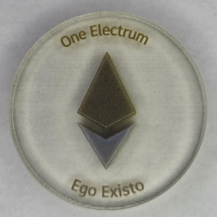
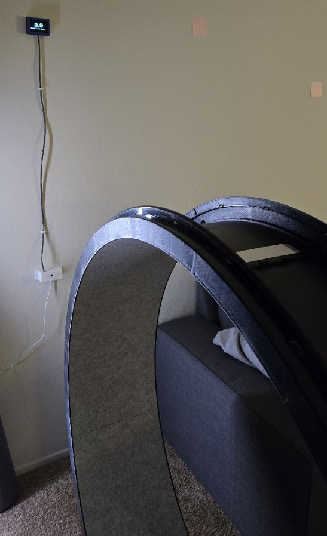
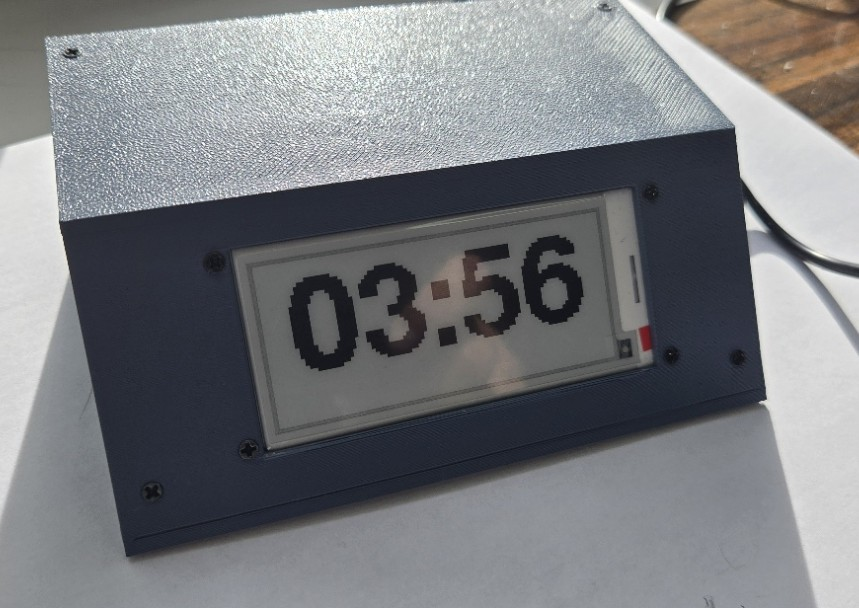
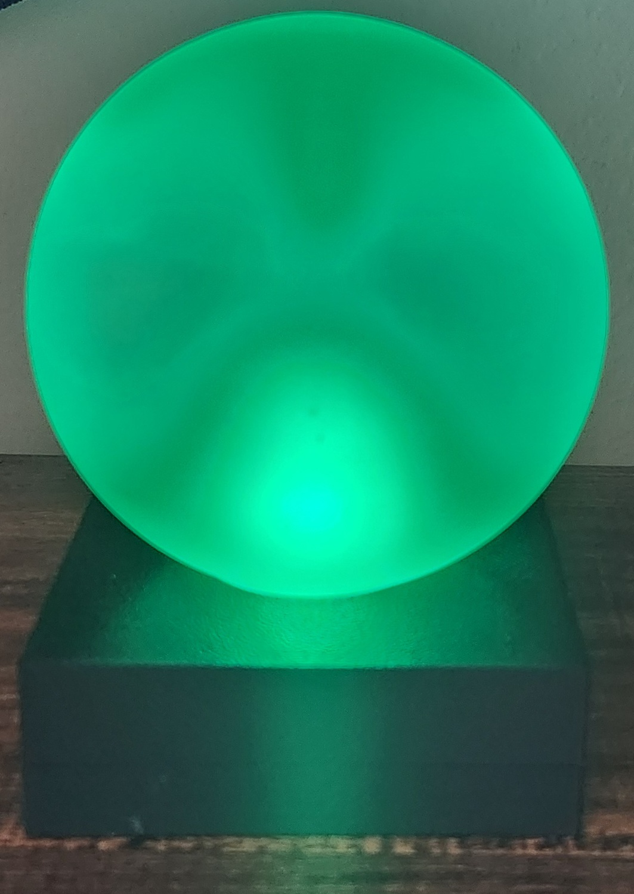
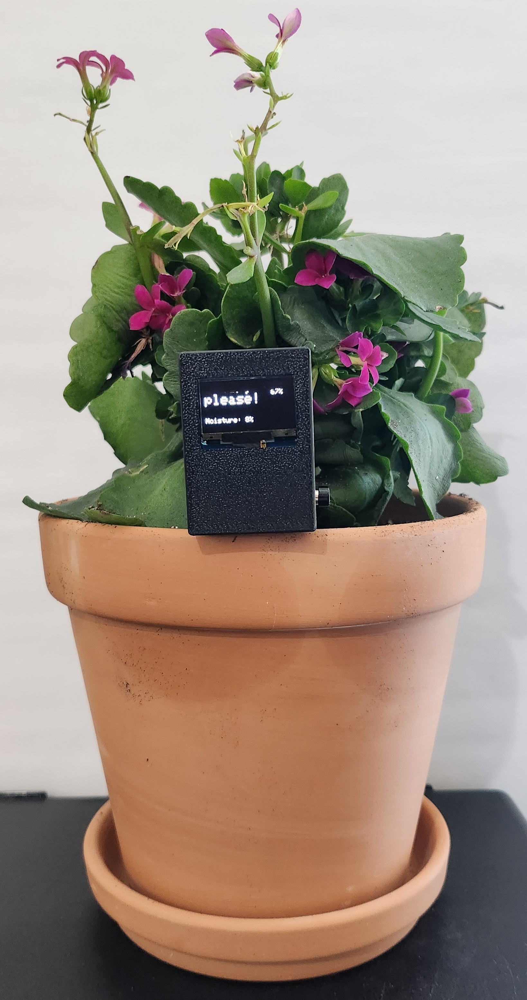
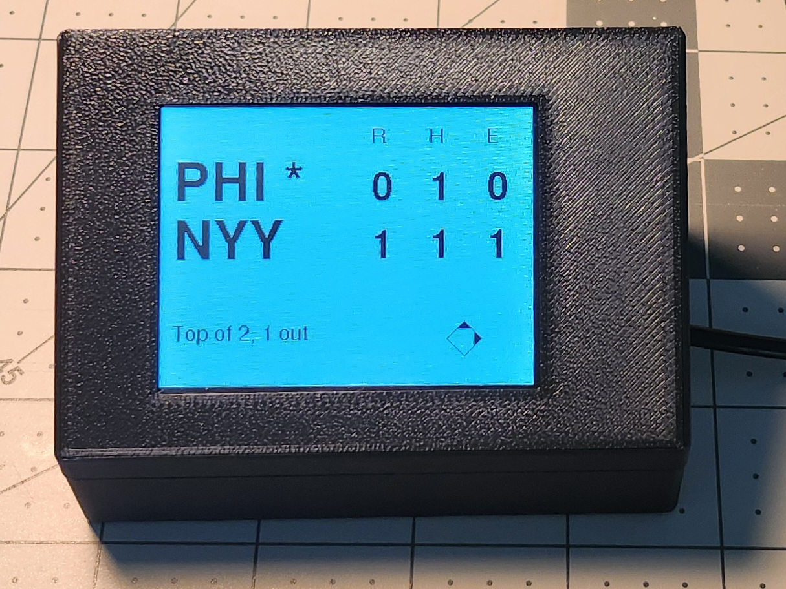

## Electronics & Maker Projects

Welcome! This portfolio showcases hands-on electronics, embedded systems, and product development projects. Each build combines hardware integration, embedded firmware, CAD design, and custom 3D-printed parts to create practical, functional devices.

Every project includes photos, design notes, firmware, and documentation so others can understand—not just see—the finished result.

## Projects
| Project | One-Sheet PDF | Description | Preview |
|---------|-----------------------|-------------|---------|
| [**Electrum Coin**](./Electrum) | * | A PolyJet printing study exploring multi-material printing, translucency, metallic finishes, and post-processing techniques on the Stratasys J850. |  |
| [**AI-CAD Ring Box**](./Cat_Speedometer) | * | An experiment in AI-assisted CAD that used a structured Gemini prompting workflow to generate a manufacturable parametric ring box from design specifications. |  |
| [**Cat Speedometer**](./Cat_Speedometer) | * | The Cat Wheel Speedometer is a computer-vision-based telemetry system that measures the running speed of a cat exercise wheel in real time. |  |
| [**GPS Clock**](./GPSClock) | * | The GPSClock is a low-power, GPS-disciplined wall clock built around an ATmega328P microcontroller. It combines a DS3231 real-time clock with periodic synchronization from a GT-U7 GPS module to maintain accurate time even during long periods without satellite visibility. |  |
| [**The Orb**](./TheOrb) | [Quick Details and Build Reference](https://raw.githubusercontent.com/ChandlerEx/Projects/main/TheOrb/docs/Orb_One_Sheet.pdf) | Ambient LED orb that visualizes live stock performance through color and pulsing light. Powered by an ESP8266 D1 Mini with custom PCB, in a 3D-printed enclosure topped with a frosted glass globe. |  |
| [**Soil Moisture Monitor**](./SoilMonitor) | [Quick Details and Build Reference](https://raw.githubusercontent.com/ChandlerEx/Projects/main/SoilMonitor/docs/SoilMon_One_Sheet.pdf) | Battery-powered OLED moisture monitor that tells plant lovers when to water. Built with a XIAO nRF52840 and capacitive sensor, in a precision-fit 3D-printed enclosure with calibration-tuned firmware for succulents. |  |
| [**Scoreboard**](./Scoreboard) | [Quick Details and Build Reference](https://raw.githubusercontent.com/ChandlerEx/Projects/main/Scoreboard/docs/Scoreboard_One_Sheet.pdf) | Desk-friendly digital clock with a hidden touchscreen that displays live MLB game data on demand. Uses an ESP32 CYD with custom 3D-printed enclosure and captive portal Wi-Fi setup. |  |

## Technologies & Skills Featured
- Developed a structured prompting workflow for Google Gemini to generate more accurate, buildable CAD models
- Operated Stratasys J850, J750, and J55 PolyJet printers using GrabCAD Print
- CAD design in Fusion 360 with working knowledge of Rhino (threads, snap-fits, friction fits)
- 3D printing in PLA, PETG, TPU, and PolyJet materials
- PCB design and assembly
- Hardware integration (microcontrollers, sensors, displays, switches, power systems)
- Embedded firmware development (ESP32, ESP8266, XIAO nRF52840)
- Arduino/C++ development for embedded systems
- Low-power firmware and battery-powered devices
- I²C and SPI peripheral integration

## Repository Structure
Most projects follows the same organized folder structure:  
ProjectName/cad/&nbsp;&nbsp;&nbsp;&nbsp;&nbsp;&nbsp;&nbsp;&nbsp;&nbsp;&nbsp;&nbsp;&nbsp;&nbsp;&nbsp;&nbsp;# Fusion 360 source files (.f3d) and STL exports  
ProjectName/docs/&nbsp;&nbsp;&nbsp;&nbsp;&nbsp;&nbsp;&nbsp;&nbsp;&nbsp;&nbsp;&nbsp;&nbsp;&nbsp;# One-sheet PDF, dimension drawings, reference documents  
ProjectName/firmware/&nbsp;&nbsp;&nbsp;&nbsp;&nbsp;&nbsp;&nbsp;# Arduino source code  
ProjectName/media/&nbsp;&nbsp;&nbsp;&nbsp;&nbsp;&nbsp;&nbsp;&nbsp;&nbsp;&nbsp;&nbsp;# Photos, renders, and videos (static assets for README)  
ProjectName/README.md&nbsp;&nbsp;# Project-specific documentation  

## About Me
I'm Chandler, a prototype technician who enjoys turning ideas into reliable, well-built hardware. My projects combine embedded electronics, CAD, firmware, 3D printing, soldering, and mechanical assembly to create functional prototypes and low-volume production hardware.

I enjoy solving practical engineering problems—designing fixtures, building clean wiring harnesses, creating robust enclosures, documenting repeatable processes, and refining prototypes until they're ready for real-world use.

Most recently I supported Google's rapid prototyping organization, where I worked with PolyJet additive manufacturing, prototype finishing, hardware rework, process documentation, and lab organization. I also developed a structured Gemini prompting workflow to improve generation of manufacturable CAD models, organized and reopened the Skunkworks electrical engineering workspace, and built electromechanical demonstration hardware for internal executive projects.

Previously at Ato, I owned the end-to-end hardware assembly process. During my time there I reduced errors and rework, tripled weekly production throughput, developed an ESP32-based validation fixture, introduced standardized testing procedures, and authored the company's first SOP manual.

Earlier, I founded and operated World Gone Silent, designing, manufacturing, documenting, and shipping electronics kits from concept through customer delivery. That experience taught me every stage of the hardware lifecycle—from sourcing components and PCB assembly to firmware, documentation, packaging, and customer support.

Today I'm looking for opportunities where I can contribute to prototype development, engineering builds, manufacturing support, and rapid iteration while continuing to expand my mechanical and embedded systems skills.
