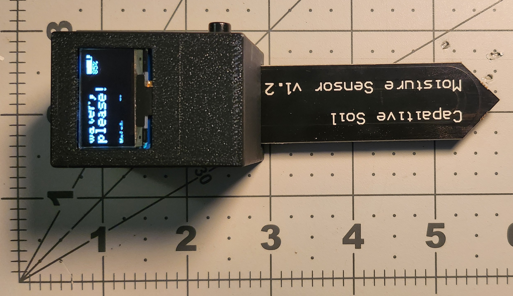
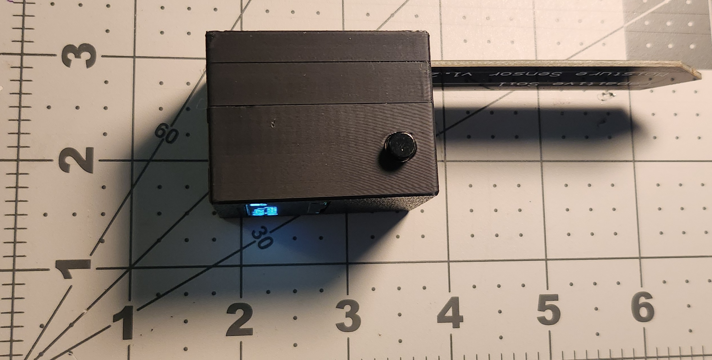
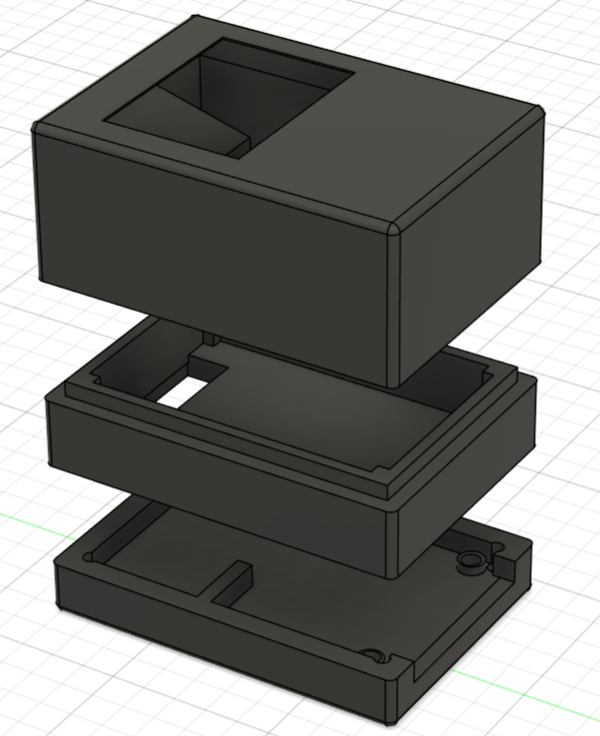
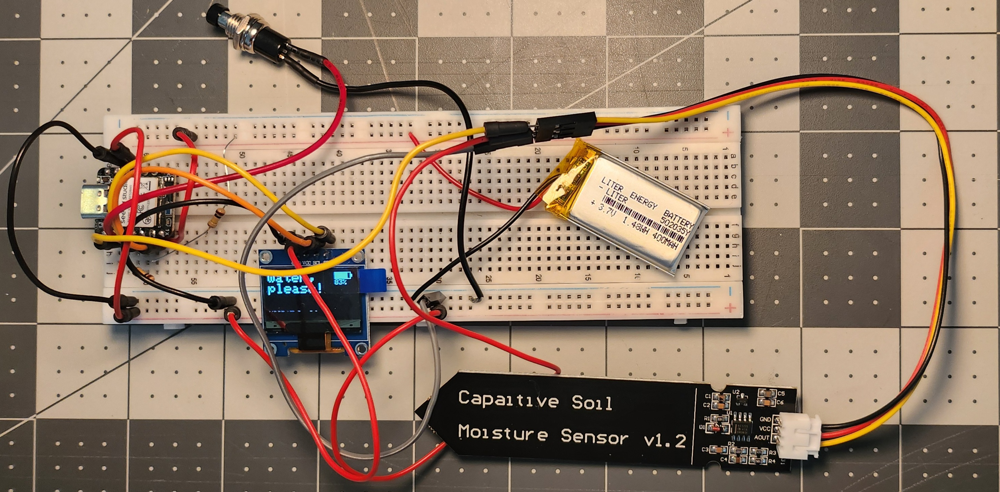
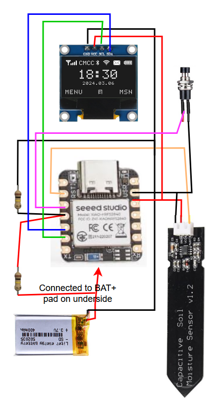

# Soil Monitor
**[One-Sheet PDF – Quick Build Reference](https://raw.githubusercontent.com/ChandlerEx/Projects/main/SoilMonitor/docs/SoilMon_One_Sheet.pdf)** 
*(Overview, dimensions, wiring, build steps, and lessons learned)*

Video demonstration - click thumbnail below:  

## Overview
The Soil Monitor is a battery-powered, OLED-based moisture sensor that shows real-time soil moisture and battery level, and tells plant lovers when 
to water. Measures 119 × 37 × 34 mm (52 g). Features a 3D-printed enclosure (Fusion 360) and calibration-tuned firmware optimized for succulents.

## Photos
**Soil Monitor in Use** 

**Top / Side Views** 

 

**Enclosure Design** - 3D enclosure modeled in Fusion 360 

## Bill of Materials
| Item | Description | Notes |
|------|-------------|-------|
| Seeed Studio XIAO nRF52840 | Ultra-compact ARM-based microcontroller with Bluetooth capability | Main processing unit; USB-C powered or LiPo battery |
| SSD1306 OLED Display (0.96") | Monochrome I2C display | Displays live soil moisture and battery status |
| Capacitive Soil Moisture Sensor | Measures soil moisture without corrosion issues | Connected via analog input |
| Custom 3D-Printed Enclosure | Multi-part design with snap fits and battery compartment | Printed in PLA; parametric CAD model in Fusion 360 |
| LiPo Battery (3.7V, 400mAh) | Rechargeable battery powering the device | Connected to onboard charging circuit |
| Voltage Divider (2 × 100kΩ resistors) | Monitors battery voltage via analog pin | Soldered to board |
| Wake Switch | Wakes device from power-saving sleep mode | Mounted in enclosure top |
| Filament (PLA) | Material for enclosure | Color as desired |
| Screws (M2 or M2.5 as designed) | Mount components securely | Qty: varies |

## Wiring

| Component                  | XIAO nRF52840 Pin          |
|---------------------------|-------------------|
| OLED (SSD1306, I2C)       | SDA → GPIO 4 SCL → GPIO 5 |
| Moisture Sensor           | A1 (Pin 1)        |
| Battery Voltage Divider   | A3 (Pin 3) via 100kΩ–100kΩ |
| Wake Button               | GPIO 2 → GND      |
| Battery                   | BAT+ pad + GND pin|

## Build Steps
- Solder the display, sensor, voltage divider, wake button, and battery to the chip
- Screw the sensor into bottom-most part of base, then run wires through internal opening
- Secure LiPo to other part of base with adhesive and screw both base pieces together
- Screw display into the topmost part of the lid, and secure switch into cradle with button facing out
- Install ground and power rails on opposite, inside walls of lid section and run ground and power to them
- Solder all pieces together, then friction fit them with the case holding the battery and the sensor
- Test and confirm all is working as expected, ideally with soil similar to the target, and with water to get a range of both dry and wet

## Code
- Open Arduino IDE, select 'XIAO nRF52840 (No Updates)'
- Connect the Seeed Studio XIAO nRF52840 board to your machine
- Upload the code in the SoilMon.ino file in the project files here to the board
  
## Lessons Learned
- Define power & size constraints before wiring & coding
- Power/ground rails simplify small builds
- Small enclosures need tighter tolerance testing
- Moisture thresholds are plant & environment specific
- Soldering on tiny boards increases short-circuit risk

## License
MIT License

 
Click here for more background and technical details about Soil Monitor

# More Details

## Background
My wife got a succulent as a gift, but she was worried about overwatering it - a common way to kill a succulent! So, to help, I decided to build a 
soil monitor and configure it specifically for succulents. 
 The result is a battery-powered soil moisture monitor with a clear OLED display and ultra-low power sleep mode. 
Designed to be compact and dead simple for plant lovers who just want to know when to water.
 This project demonstrates:
- sensor calibration & analog input
- power management
- embedded UI design
- PCB-free low-power prototyping

## Project Goal
A compact, effective monitor for soil moisture coded in Arduino-style C++ with:
- A simple, low power display that shows
  - Moisture percentage
  - What to do with that info (Showing 'OK' or 'Needs water' depending on moisture)
  - A battery icon that conveys visually how much power remains
  - A percentage display conveying how much power remains
- A 3.7 V LiPo (charged via USB-C) for wireless power
- A sleep mode that saves battery after inactivity and powers down much of the internals
- A wake button to rapidly get the monitor ready for work
- Accurate soil readings via capacitive sensor
- A tiny SoC to run the show (the Seeed Studio XIAO nRF52840 which is ~18mm X 21mm)
- Recharge capability (built into the nRF52840)

## Calibration
Moisture readings are calibrated between:
- *Dry:* `2665`
- *Wet:* `1155`
Mapped to 0–100% for display

## Enclosure
- Designed in Fusion 360 
- Custom 3D-printed shell with two bottom pieces that screw together and friction fit into the top piece
- Ground and power rails for easier soldering
- Holes with precise tolerances for display and wake button

## Hardware
- XIAO nRF52840 SoC
- Liter 3.7V 400mAh 502035 LiPo Battery
- Stemedu Capacitive Analog Soil Moisture Sensor
- AITRIP 0.96 Inch OLED Display Module 12864
- Gebildet 7mm Black Prewired Mini Momentary Push Button,SPST
- Voltage Divider (2× 100kΩ - to scale battery voltage to safe ADC range)

## Firmware Logic Flow
- Startup
  - Initializes I2C display, ADCs, and button input
  - Loads sleep/reset logic
  - Reads initial moisture and battery values
- Active Mode (awake)
  - Refreshes OLED every 5 seconds
  - Displays current moisture %, status message, battery level
  - After 45 seconds of inactivity, powers down OLED and enters manual sleep
- Sleep Mode
  - Display powers down (SSD1306_DISPLAYOFF)
  - Device idles until wake button is pressed
- Wake Trigger
  - GPIO2 is pulled LOW via button → NVIC_SystemReset() executes
  - Full reboot ensures display and sensors reinitialize cleanly

## Files
- ./firmware/SoilMon.ino -- Full Arduino sketch
- ./cad/SoilMon.f3d -- Fusion 360 source
- ./cad/SoilMon.stl -- STL file for printing

## Potential Future Features
- Captive portal for viewing moisture status over Wi-Fi
- Cloud logging & last-watered tracking
- User-set calibration menu
- Deeper sleep modes for even longer battery life
- Rubber gasket for sensor protection

