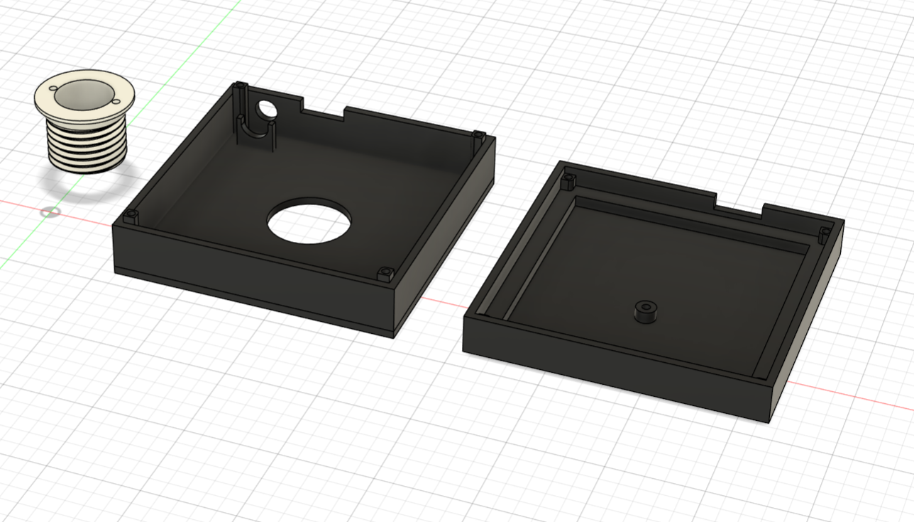
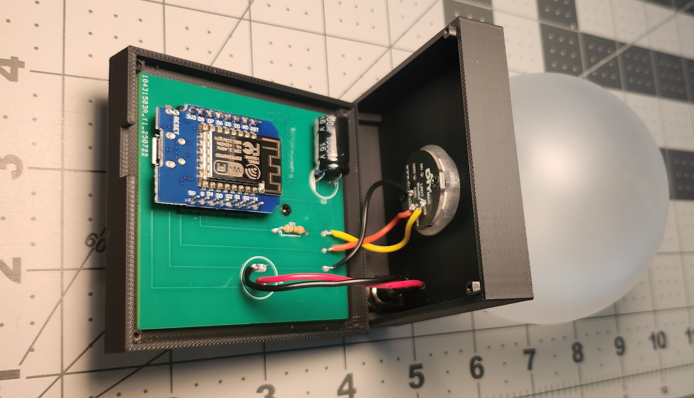

# The Orb
**[One-Sheet PDF – Quick Build Reference](https://raw.githubusercontent.com/ChandlerEx/Projects/main/TheOrb/docs/Orb_One_Sheet.pdf)**  
*(Overview, dimensions, wiring, build steps, and lessons learned)*

Video demonstration - click thumbnail below:  

## Overview
The Orb is a frosted-glass desktop indicator that uses color and pulsing light to show whether a selected stock, index, or crypto is up or down, 
and by how much. Measures 100 × 80 × 80 mm (110 g). Features a custom PCB (EasyEDA) and a fully parametric 3D-printed enclosure (Fusion 360).

## Photos
**Enclosure Design** - 3D enclosure modeled in Fusion 360 

**Finished Build**  

## Bill of Materials
| Item | Description | Notes |
|------|-------------|-------|
| ESP8266 D1 Mini (LOLIN/WEMOS-compatible) | Controls LED animations and Wi-Fi connection for live stock updates | USB powered |
| WS2812B LED Ring(s) | RGB LED rings providing visual output | Mounted inside dome |
| 7mm Black Prewired Mini Momentary Push Button,SPST | For resetting device if new stock or Wi-Fi is needed | Mounted on back of enclosure by USB port |
| 330Ω resistor | Protects the LED ring from voltage spikes and ringing on the data line | Simple to add, and a bit of insurance |
| 1000µF capacitor | Smooths voltage to LED | Another bit of protection and insurance for the LED ring |
| Custom PCB | Consolidates LED, ESP8266 D1 Mini, capacitor and resistor connections | Designed in EasyEDA |
| Custom 3D-Printed Enclosure | Three-part design with two part base and PETG thread piece for globe | Printed in PLA/PETG; parametric CAD model in Fusion 360 |
| Translucent Dome (Frosted Glass) | Diffuses LED light for a smooth glow | Secured with threaded top |
| USB Cable (Micro-USB to USB-A) | Power and programming cable | Routed through rear or base port |
| Filament (PLA/PETG) | PLA for base, Transparent PETG for threaded connector | Color and transparency as desired |
| Screws (M2x10mm) | Secures top of enclosure and base to eachother | Qty: 4 |
| Adhesive Rubber Feet | For enclosure stability | Qty: 4 |

## Wiring
Wiring is extremely simple, as all components are connected to the custom PCB I specifically designed for this project: 

## Build Steps
- Solder all components to the PCB
- Screw PCB into bottom of enclosure base, ensuring USB port faces USB hole in enclosure
- Mount the switch into the cradle on top of enclosure base
- Screw LED ring into base of threaded piece, and push through the top hole
- Screw glass globe onto threaded piece sticking out from top
- Secure top and bottom pieces of base together with screws

## Code
- Open Arduino IDE, then connect ESP8266 to computer
- Select 'LOLIN(WEMOS) D1 R2 & mini' for board
- Upload the code found in the 'InfoOrb.ino' file in the project documents here
- Go through configuration steps, keeping an eye on Serial monitor for any unexpected issues

## Lessons Learned
- Using 'ESP_DoubleResetDetector' made captive portal access easy without access to the physical board.
- Pulse animations look far smoother when brightness modulation is sinusoidal.
- A resistor + capacitor drastically improves LED stability and reduces flicker.

## License
MIT license

---

Click here for more background and technical details about The Orb

  
# More Details

## Background
For years I've had a fasination with an old concept - ambient computing. The idea is to convey digital information in a sensory way that doesn't 
rely on screens. I've had the idea in my head for as long as I can remember, but this pursuit provided an opportunity to bring it from brain to reality.

The result is an innocuous looking orb on a small pedestal that conveys with color and pulsing whether a certain financial index, commodity, stock 
or even crypto is up or down that day, and, by slowly pulsing the light, even conveys how drastic the change is.

This project demonstrates:
- Shows market change percentage for a selected stock/index/crypto via color and pulse speed
- Allows quick Wi-Fi setup via a captive portal
- Handles connection failures gracefully with visual feedback
- Integration of threaded and screw fits
- Use of different kinds of filaments (PLA, PETG)

## Project Goal
A plug-and-play desktop stock indicator that:
- Shows market change percentage for a selected financial index, stock, or crypto holding via color and pulse speed
- Allows quick Wi-Fi setup via a captive portal
- Stores and remembers the selected ticker in EEPROM
- Handles connection failures gracefully with visual feedback
- Updates data every 30 seconds without needing user interaction

## Hardware
- Microcontroller: ESP8266 D1 Mini (LOLIN/WEMOS-compatible)
- LEDs: 7-LED WS2812B RGB ring
- Power: Micro-USB 5V
- Enclosure: 80mm glass dome with custom-printed base
- Extras:
  - 330 Ω resistor (in series from D4 → DIN)
  - 1000 µF capacitor (across VCC and GND at LED ring)

## Architecture Overview
- Language: Arduino-style C++
- Startup Behavior:
  - Solid yellow boot color
  - If double reset is detected, Wi-Fi settings reset and captive portal starts
  - Captive portal allows user to enter: Wi-Fi SSID/password, stock ticker (defaults to SPY), ticker stored in EEPROM
- Data Fetch:
  - HTTPS GET to Finnhub API every 30 seconds
  - Calculates % change from previous close
- LED Logic:
  - Green: positive change
  - Red: negative change
  - Pulse speed scales with volatility: ≥ 3%: very fast pulse; ≥ 2%: fast pulse; ≥ 1%: slow pulse
  - Solid Yellow = Awaiting Wi-Fi info, typically on first start-up
  - Two blue flashes indicate a network/parse failure. 

## Error Handling
- Connection/data error: flashes blue
- Persistent Wi-Fi failure: blue error loop until reset
- Animations:
  - First data fetch: fades from yellow to new color
  - Subsequent updates: smooth brightness pulsing

## Visual Feedback Reference
| Event                  | LED Behavior                               |
|------------------------|--------------------------------------------|
| Boot                   | Solid yellow                               |
| Double reset detected  | Yellow/blue alternating blinks             |
| Positive change        | Solid/pulsing green                        |
| Negative change        | Solid/pulsing red                          |
| Wi-Fi/data error       | Two quick blue flashes                     |
| Wi-Fi connection fail  | Repeating 10× blue blink cycle              |

## Files
- ./firmware/InfoOrb.ino — Full Arduino sketch
- ./cad/TheOrb.f3d — Fusion 360 enclosure design
- ./cad/TheOrb.stl — STL file for base/enclosure
- [Finnhub API](https://finnhub.io) — Live stock data source

# Potential Future Features
- User-selectable LED brightness in captive portal  
- Multiple ticker rotation (e.g., SPY + a personal stock watchlist)  
- Auto-off or auto-dim during non-market hours to save power  
- E-paper or OLED module add-on for numeric display of price/percentage  
- Configurable pulse styles (fade, strobe, breathing) per user preference  

## Photos
**Early Prototype**  

**Enclosure Design**  

**Finished Build**  

## Quick start (new user workflow)
* **Power up and join setup Wi-Fi**
  - On boot the firmware starts WiFiManager and opens an AP named 'Orb_Setup' for provisioning. Connect to that network, direct your browser
to 192.168.4.1, enter your Wi-Fi credentials and populate the Stock Ticker (default: SPY) field.
* **Reconfiguring later**
  - Performing a double-reset triggers configuration mode: settings are cleared, the 'Orb_Setup' portal opens again, and the entered ticker is saved.
* **Ticker storage & fallback**
  - The selected ticker is persisted to EEPROM; on normal boots the orb uses the saved value. If the stored value is invalid, it falls back to 'SPY'.
* **First data pull**
  - After setup, the orb immediately fetches market data once and logs the final ticker to Serial.
* **Ongoing updates**
  * The orb refreshes data every 30 seconds and animates continuously.
* **What the lights mean**
  * **Green** = positive change
  * **Red** = negative change
  * **Solid Yellow** = Awaiting Wi-Fi info, typically on first start-up
  * *NOTE* Pulse speed increases with magnitude (≥1%, ≥2%, ≥3% tiers)
  * **Two blue flashes** indicate a network/parse failure.

## Feature list
* **Target & LED hardware**
  * Uses an ESP8266 (D1 Mini) with an Adafruit NeoPixel and a ring of 7 LEDs on pin D4 (GRB, 800 kHz). Brightness is set to 60 at startup. 
* **Wi-Fi provisioning & reconfiguration**
  * WiFiManager portal 'Orb_Setup' for first-time setup and later changes;
  * includes a custom parameter for Stock Ticker (default: 'SPY', to track the S&P500) Can also be used to track crypto, individual stocks, even commodities
  * DoubleResetDetector (using button on back of base) puts the device back into setup mode and clears saved settings.  
* **Persistent configuration**
  * EEPROM initialized to 64 bytes; ticker stored starting at address 0 via 'saveTickerToEEPROM()' / 'readTickerFromEEPROM()'.
  * Invalid storage auto-reverts to SPY. (Save loop writes up to 9 characters.) 
* **Data source & security**
  * Fetches quotes from Finnhub’s '/api/v1/quote' endpoint using HTTPS via 'WiFiClientSecure' (certificate checking disabled with 'setInsecure()'), and 'ESP8266HTTPClient'.
* **Update cadence**
  * Immediate fetch on boot, then 30-second polling loop. 
* **Parsing & signal calculation**
  * Parses JSON fields 'c' (current) and 'pc' (previous close), computes percent change '(c - pc) / pc * 100'.
* **Color logic**
  * Green for ≥0% change; Red for <0%.
* **Magnitude-based pulsing**
  * Pulse speed scales with absolute change: ≥3% → 30, ≥2% → 50, ≥1% → 80, else solid.
  * Animation uses a sine-based brightness wave clamped to 50–100% for a smooth breathing effect.
* **Error feedback**
  * Any HTTP/connection/parse failure calls 'flashBlueError()' which blinks blue twice. 
* **Serial diagnostics**
  * Verbose logs include the final ticker, request URL, HTTP status, payload, and computed market change %.  

